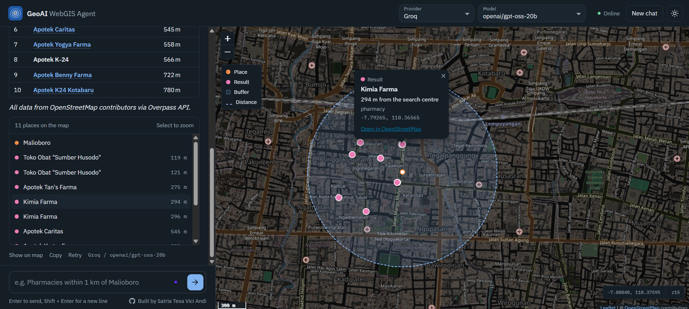
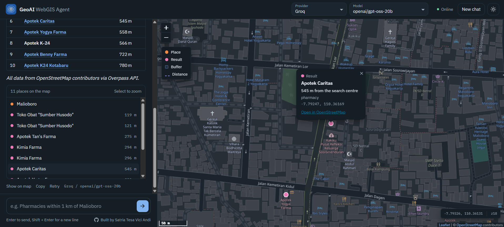
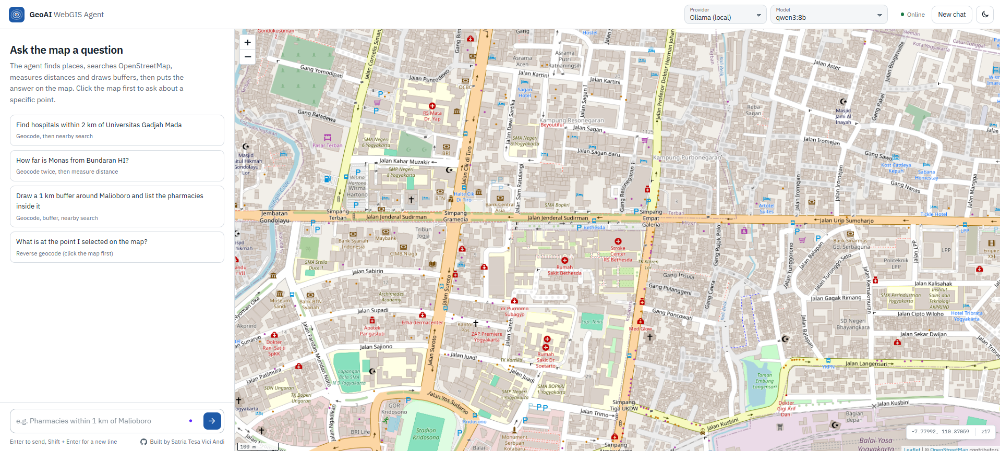
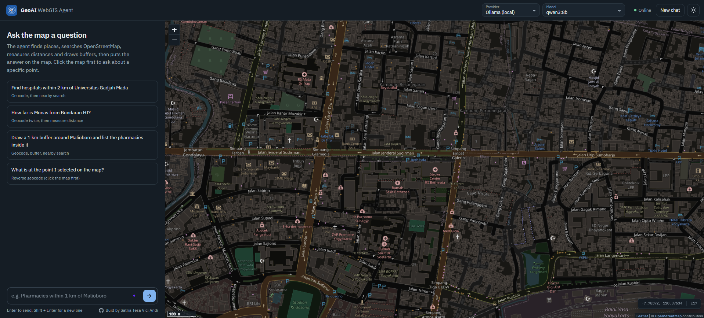
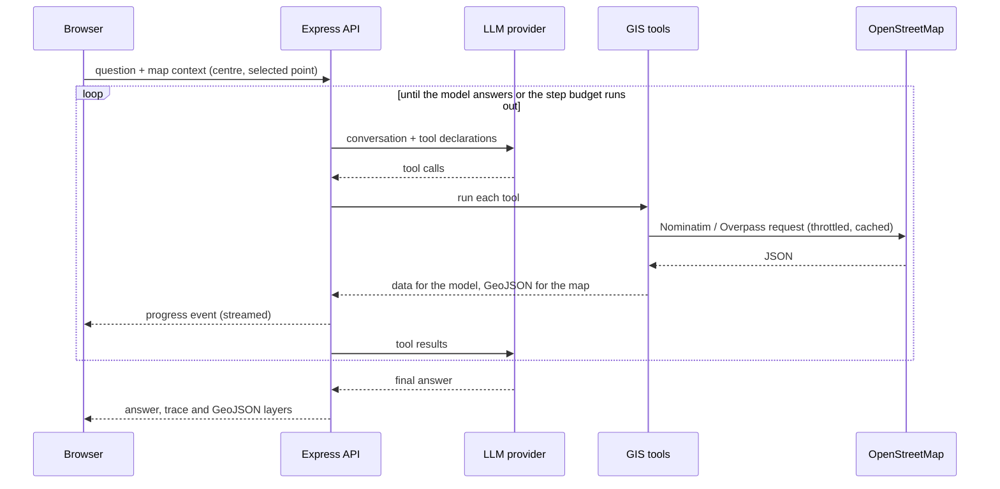

# GeoAI WebGIS Agent

[](https://github.com/satriatva/geoai-webgis-agent/actions/workflows/ci.yml)


Ask a web map a question in plain language. An LLM agent decides which GIS tools to run (geocoding, nearby search, distance, buffer), the Node.js backend runs them against OpenStreetMap, and the answer appears in the chat and on a Leaflet map.

[](docs/video/demo.mp4)

▶ [Watch the 74-second demo](docs/video/demo.mp4): hospitals near UGM, the distance from Monas to Bundaran HI, pharmacies inside a buffer around Malioboro, and a reverse-geocoded point, all on Groq with `openai/gpt-oss-20b`.

<details>
<summary>More screenshots</summary>

Select a result in the list (or a name in the answer) to zoom to it and open its popup:



Start screen in the light and dark themes:




</details>

## Features

- Works with any LLM that supports tool calling. Pick the provider and model in the app: Google Gemini, OpenAI, or open models such as Qwen 3 and Llama 3 through Ollama, Groq or OpenRouter.
- Plans multi-step questions on its own. "Pharmacies within 1 km of Malioboro" becomes geocode, buffer, then a nearby search.
- Shows its work while it runs. Each tool call appears live with its arguments and run time, and stays available as a trace under the answer.
- Draws every result on the map as GeoJSON. Place names in the answer and the result list are clickable: the map zooms to the place and opens a popup with distance, category, coordinates and a link to OpenStreetMap.
- Understands map context. Click the map to select a point, then ask "what is here?" or "find cafes near this point".
- Lets you retry an answer, edit a sent question, stop a running request or start a new chat.
- Answers in English or Indonesian, with light and dark themes and a mobile layout.

Some questions to try:

| Question | Tools the agent uses |
| --- | --- |
| Find hospitals within 2 km of Universitas Gadjah Mada | `geocode_place`, `find_nearby_places` |
| How far is Monas from Bundaran HI? | `geocode_place` (twice), `measure_distance` |
| Draw a 1 km buffer around Malioboro and list the pharmacies inside it | `geocode_place`, `create_buffer`, `find_nearby_places` |
| What is at the point I selected? | `reverse_geocode` |

## Tech stack

| Layer | Tools |
| --- | --- |
| Backend | Node.js 18+, Express 5, Turf.js |
| LLM providers | Google Gemini (`@google/genai`); OpenAI, Ollama, Groq, OpenRouter, LM Studio or vLLM through the OpenAI Chat Completions format |
| Frontend | Vanilla JavaScript (ES modules), Leaflet, OpenStreetMap tiles, IBM Plex (self-hosted) |
| Data | OpenStreetMap through Nominatim and the Overpass API |
| Quality | Node test runner (44 offline tests), GitHub Actions on Node 20 and 22 |

## Quick start

You need Node.js 18.17 or newer and one model provider: a free Gemini or Groq API key, or [Ollama](https://ollama.com) running locally.

```bash
git clone https://github.com/satriatva/geoai-webgis-agent.git
cd geoai-webgis-agent
npm install
cp .env.example .env    # Windows: copy .env.example .env
```

Add your key to `.env` (for example `GEMINI_API_KEY=...`), then start the app:

```bash
npm run dev             # http://localhost:3000
npm test                # optional, no API key needed
```

Every provider with a key in `.env` can be selected from the header of the app. Ollama needs no key. [docs/SETUP.md](docs/SETUP.md) covers each provider, hardware needs for local models, all settings and common errors.

## How the agent works



The loop is in [`src/agent.js`](src/agent.js). It keeps the conversation in a provider-neutral format, and the adapters in [`src/llm/`](src/llm) translate it for each API. Every tool returns two things: a compact `data` object for the model and a `geojson` layer for the map, so geometry never ends up in the prompt.

| Tool | What it does | Source |
| --- | --- | --- |
| `geocode_place` | Place name or address to coordinates | Nominatim |
| `reverse_geocode` | Coordinates to address and administrative areas | Nominatim |
| `find_nearby_places` | Places of one category within a radius (up to 5 km), nearest first | Overpass API |
| `measure_distance` | Straight-line distance and compass bearing | Turf.js |
| `create_buffer` | Circular buffer and its area | Turf.js |

Supported categories (hospital, pharmacy, school, cafe, bus stop and 12 more) are mapped to OSM tags in [`src/tools/places.js`](src/tools/places.js). Adding one is a single line.

## API

`POST /api/chat`

```json
{
  "conversation": [{ "role": "user", "text": "Find cafes within 500 m of the selected point" }],
  "mapContext": { "center": { "lat": -7.78, "lon": 110.37 }, "zoom": 13, "selectedPoint": { "lat": -7.7713, "lon": 110.3775 } },
  "provider": "groq",
  "model": "llama-3.3-70b-versatile"
}
```

The response contains `reply` (Markdown), `steps` (tool trace), `layers` (GeoJSON per tool call) and the `provider` and `model` that answered. `provider` and `model` in the request are optional. Send `Accept: application/x-ndjson` to receive progress events line by line before the final result; the web client uses this for the live tool list.

Other endpoints: `GET /api/providers` lists the providers and whether each has a key, `GET /api/providers/:name/models` lists a provider's models (cached for 10 minutes), and `GET /api/health` reports the default provider.

## Project structure

```
src/
  server.js              Express app, validation, streaming
  agent.js               tool-calling loop
  config.js              settings from .env
  llm/                   provider presets and adapters (Gemini, OpenAI-compatible)
  tools/                 geocoding, nearby search, distance, buffer, HTTP helpers
public/
  index.html, css/       web client
  js/app.js              conversation and live progress
  js/map.js              Leaflet map and result layers
  js/picker.js           provider and model picker
  js/results.js          clickable results
test/                    unit and API tests with a fake model and mocked network
docs/SETUP.md            setup per provider, settings, troubleshooting
docs/screenshots/, docs/video/   images and the demo recording used in this README
```

## Design decisions

**Model-agnostic from the start.** Tools are declared once in JSON Schema and the history uses a neutral format, so supporting a new provider means writing a small adapter. It also means the app is not tied to one vendor's pricing or rate limits.

**The model gets data, the map gets geometry.** Keeping GeoJSON out of the prompt keeps requests small and cheap, and the model's answer stays grounded in what the tools returned.

**Fair use of OpenStreetMap services.** Nominatim calls are limited to one per second, every request has an identifying User-Agent, and identical queries are cached for 10 minutes, as the [Nominatim usage policy](https://operations.osmfoundation.org/policies/nominatim/) asks.

**Failures do not end the conversation.** A failing tool sends its error back to the model, which can fix the arguments or explain the problem. Rate limits and server errors from the provider are retried with backoff, using the delay the provider suggests.

**Every loop has a limit.** Search radius, result count, conversation length and agent steps are capped on the server. If a model repeats an identical call, the earlier result is reused (shown as ↺ in the trace). When the step budget runs out, the model is asked for an answer with tools turned off, so the user always gets a reply.

**Small surface on the client.** No framework and no CDN: Leaflet and the fonts are served from `node_modules`, and model output is escaped before it is rendered.

## Roadmap

- Road distance and travel-time areas with OSRM or Valhalla (distances are straight-line today).
- A PostGIS tool for querying your own spatial datasets.
- Exposing the GIS tools as an MCP server so other agents can use them.

The public Nominatim and Overpass servers are rate-limited, so heavier use needs self-hosted instances.

## Background

The project started as a Gemini chatbot from the Hacktiv8 *AI Productivity and AI API Integration for Developers* program. I rebuilt it as a geospatial agent to bring LLM tool calling into the WebGIS work I do every day.

## Author

**Satria Tesa Vici Andi**, GIS Engineer working on GeoAI and WebGIS.
[GitHub](https://github.com/satriatva) · [LinkedIn](https://www.linkedin.com/in/satriatesaviciandi)

## License

[MIT](LICENSE). Map data © OpenStreetMap contributors, available under the ODbL.
